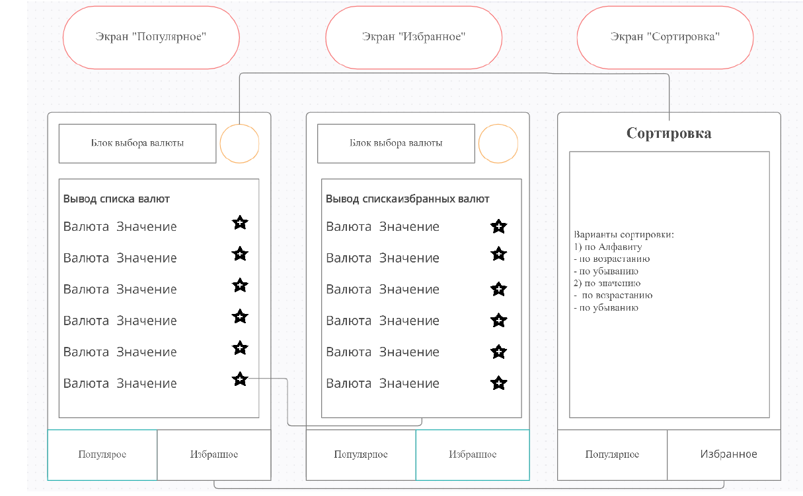

**Проект отображение курсы валют.**

Макеты экранов созданы для формирования схематического понимания поставленной задачи

Данные получаем из API https://apilayer.com/marketplace/exchangerates_data-api

**Экраны:**
1) Экран "Популярные" отображает курсы валют относительно выбранной валюты. 
Перед отображением, пара валют (базовая/котируемая), синхронизируются с избранными
хронящимися в локальной базе данных. Если пара существует, 
то отмечается как избранный. 
При клике на иконку "избранный" пара удаляется из локальной базы, если она уже там есть
или добавляется при ее отсуствии. 
Клик на иконку "сортировка" открывает окно сортировки и подписывается на получение результата. 
В соответствии с полученным результатом производиться сортировкаю

2) Окно "Избранные" отображает курсы валют, хранящиеся на локальной базе, относительно выбранного курса. 
Перед отображжением данных из локальной базы всегда идет запрос в сеть для получения актуального курса.
При клике на иконку "избранные" пара удаляется из локальной базы и исчезает из списка 
(экран подписан на измене в локально базе). Фуннкционал сортировки такой же как в окне "Популярные".
3) Скрин "Сортировка" позволяет выбрать вариант сортировка из четырех вариантов(варианты есть на изображении).
При выборе варианта(или не выборе) и навигации назад(или клик на кнопку применить), результат выбора передаеться 
через NavController. Вызвавший это окно подписывается на результат и, при получении опции, применяет сортировку.

**Стек технологий:** Kotlin, MVVM, StateFlow, Coroutines, Room, Hilt, Jetpack Compose, Retrofit, Navigation component